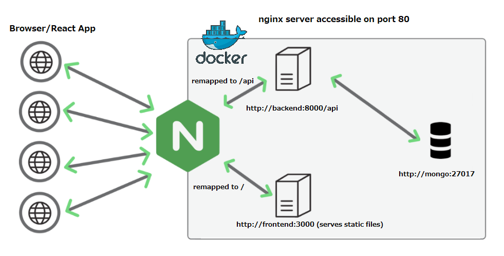
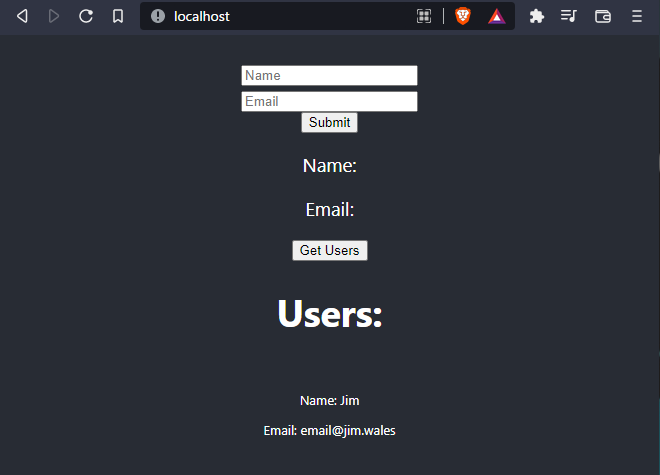

# ts-express-tdd-docker-nginx

This is a small project to test nginx, I want to use docker-compose to host a single-page app with a back-end and database (in this case mongoDB).

It has a mongo database that stores a user name and an associated email address, there is an insertion and deletion REST API, as well as a GET request for all the users.


## Using nginx
1. Docker compose spins up 3 servers (frontend, backend and mongo) the entry point is http://hostAddress:80
2. The frontend server serves client static files in a docker container on http://localhost:3000 _(only accessible by other containers)_ <br>
 _nginx remaps https://hostAddress:80/ -> http://frontend:3000/   (frontend in the docker-compose maps to the individual container)_
3. The backend NodeJS API is in another container which runs on http://localhost:8000 _(only accessible by other containers)_ <br> 
 _nginx remaps https://hostAddress:80/api -> http://backend:8000/api (backend in the docker-compose maps to the individual container)_
4. The mongo database is in a seperate container <br>
_we don't remap mongo in the nginx conf, we only want the api server to have access, and to prevent outside access_


<br/>

## UI

Building and running ```docker-compose up``` navigating to http://localhost will give this screen: 



## Installing and running the Node backend.

A template backend typescript project using REST with express and supertest for TDD

This project comes preset for vscode, the included ```.vscode/launch.json``` allows for running of the app with debugging as well as running of mocha tests with debugging. 

## Commands:

Install: (requires node and npm)
``` npm install ```

Build: 
``` npm run build ```

Start:
``` npm run start ```

Test:
``` npm run test ```

Any tests added to the test folder will automatically be tested. 

## REST API

### POST ```/api/v1/user```

Example request:
```
POST /api/v1/user HTTP/1.1
Accept: application/json
Content-Type: application/json
Content-Length: xy

{
    "name": "John Doe",
    "email": "JohnDoe@emailProvider.com"
}
```
Example response:
```
HTTP/1.1 200 OK
Server: My RESTful API
Content-Type: application/json; charset=utf-8
Content-Length: xy

"Added user John Doe to the database" 

```

### GET ```/api/v1/users```

Example request:
```
GET /api/v1/users HTTP/1.1
```

Example response:
```
HTTP/1.1 200 OK
Server: My RESTful API
Content-Type: application/json; charset=utf-8
Content-Length: xy

[
  {
    "name": "John Doe",
    "email": "JohnDoe@emailProvider.com"
  },
  {
    "name": "Tim Smith",
    "email": "TimSmith@OtherEmailProvider.jp"
]
```

## Installing and running the React frontend.

### `npm start`

Runs the app in the development mode.\
Open [http://localhost:3000](http://localhost:3000) to view it in the browser.

The page will reload if you make edits.\
You will also see any lint errors in the console.

### `npm test`

Launches the test runner in the interactive watch mode.\
See the section about [running tests](https://facebook.github.io/create-react-app/docs/running-tests) for more information.

### `npm run build`

Builds the app for production to the `build` folder.\
It correctly bundles React in production mode and optimizes the build for the best performance.


## Jenkins CI/CD support
It has Jenkins support, If you have a Jenkins server you can use the Jenkins github plugin to set up a job. It's much easier through blue-ocean. You can create a new pipeline, point it at your github repository and it will automatically build your project.


## Current progress

- [ ] Updated frontend to call the api.
  - [x] Add a form to add user.
  - [x] Add a component to display the current users
  - [ ] Add a UI widget to delete a user.
  - [ ] Handle error responses correctly in Users component.
  - [x] Update the backend api paths with a configurable host via env variables.
- [x] Add a nginx.conf file
  - [ ] Add certificate, using certbot.
  - [ ] Add a readme on using certbot and adding cert volumes through docker. 
- [ ] Make nginx optional for deployments with nginx installed directly on the metal. 
- [ ] Update CORS to be less permissable, i.e add a prod mode. 
- [x] Dockerise frontend
  - [ ] Narrow down files that should be in the docker image.
- [x] Dockerise backend
  - [ ] Narrow down files that should be in the docker image.
- [x] Add docker-compose.yml
- [x] Jenkins build jobs
  - [ ] Add a jenkins job to build and test the backend
  - [ ] Add a Jenkins job to build the test frontend.
- [ ] Better capture API errors and render a dummy template
- [ ] write a readme on how to deploy with nginx on the machine rather that docker.
