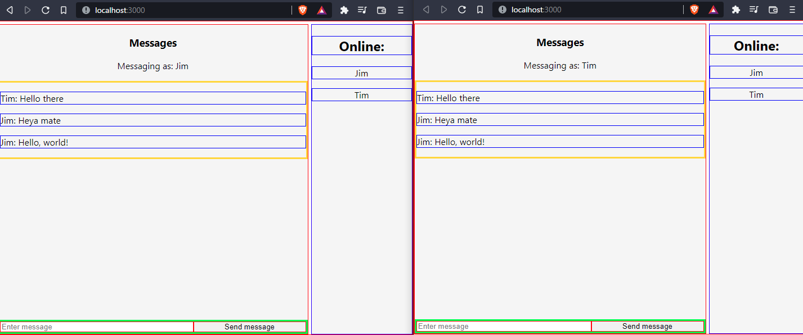

# ts-react-socket-docker-chat

This project consists of a small chat app built in react which communicates via socket to a NodeJS backend which then gets rebroadcasted to all connected clients. 

## UI

Building and running ```docker-compose up``` navigating to http://localhost will give this screen: 



It has a mongo database that stores chat logs and timestamps. 


## Using nginx
1. Docker compose spins up 3 servers (frontend, backend and mongo) the entry point is http://hostAddress:80
2. The frontend server serves client static files in a docker container on http://localhost:3000 _(only accessible by other containers)_ <br>
 _nginx remaps https://hostAddress:80/ -> http://frontend:3000/   (frontend in the docker-compose maps to the individual container)_
3. The backend NodeJS API is in another container which runs on http://localhost:8000 _(only accessible by other containers)_ <br> 
 _nginx remaps https://hostAddress:80/api -> http://backend:8000/api (backend in the docker-compose maps to the individual container)_
4. The mongo database is in a seperate container <br>
_we don't remap mongo in the nginx conf, we only want the api server to have access, and to prevent outside access_


<br/>


## Installing and running the Node backend.

A template backend typescript project using REST with express and supertest for TDD

This project comes preset for vscode, the included ```.vscode/launch.json``` allows for running of the app with debugging as well as running of mocha tests with debugging. 

## Commands:

Install: (requires node and npm)
``` npm install ```

Build: 
``` npm run build ```

Start:
``` npm run start ```

Test:
``` npm run test ```

Any tests added to the test folder will automatically be tested. 

## Installing and running the React frontend.

### `npm start`

Runs the app in the development mode.\
Open [http://localhost:3000](http://localhost:3000) to view it in the browser.

The page will reload if you make edits.\
You will also see any lint errors in the console.

### `npm test`

Launches the test runner in the interactive watch mode.\
See the section about [running tests](https://facebook.github.io/create-react-app/docs/running-tests) for more information.

### `npm run build`

Builds the app for production to the `build` folder.\
It correctly bundles React in production mode and optimizes the build for the best performance.


## Jenkins CI/CD support
It has Jenkins support, If you have a Jenkins server you can use the Jenkins github plugin to set up a job. It's much easier through blue-ocean. You can create a new pipeline, point it at your github repository and it will automatically build your project.


## Current progress

- [x] Write a socket class for the server 
- [ ] Write a socketchat component for react frontend
- [ ] When a connectin is closed, clean up the list of online users
- [x] Fix all styles to max 500px
- [x] Figure out horizontal max sizes
- [ ] Create a max text size icon 
- [x] Fix formatting of names to the left 
- [x] Fix styling of input box
- [ ] Wire up server class to mongodb 
- [ ] Add correct nginx configuration
- [ ] Add correct docker configuration for instantaneous deployements
